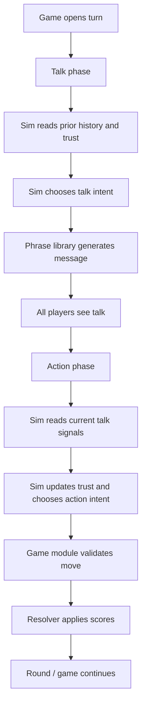

# Sims Architecture

**Status:** draft
**Purpose:** high-level map of the major pieces for Sims and how they fit
together.

## Overview

Sims are programmatic players that plug into the existing Hoard-Hurt-Help game
loop. They do not replace the game engine. They sit on top of it as a new kind
of player behavior.

The architecture keeps the current platform intact:

- the scheduler still runs the game
- the resolver still scores turns
- the API and UI still expose the game
- Sims just provide deterministic decisions and talk

## Main Pieces

| Piece | Responsibility |
|---|---|
| Game engine | Owns turns, rounds, deadlines, and resolution |
| Sim engine | Chooses talk intents, action intents, and deterministic phrasing |
| Trust model | Tracks how each Sim feels about other players |
| Talk signal reader | Turns recent public chat into simple typed signals |
| Phrase library | Turns a talk intent and truth mode into one canonical message |
| Scheduler integration | Runs Sims in the talk phase and action phase at the right time |
| Admin tools | Create Sims, assign presets, and place them into games |
| UI and exports | Show Sims clearly and keep their metadata visible |

## Runtime Flow



## Sim Structure

A Sim is defined by a small set of traits:

```text
strategy + truthfulness + trust model + seed
```

Those traits are enough to produce many different deterministic personalities
without turning the system into an LLM prompt runner.

The important separation is:

- **strategy** decides what kind of player the Sim is
- **truthfulness** decides how honestly it talks
- **trust model** decides how it interprets other players
- **seed** makes tie-breaks and wording repeatable

## Two-Phase Behavior

Sims behave in two steps each turn:

1. During the talk phase, a Sim chooses a talk intent and emits a message.
2. During the action phase, the Sim reads the current turn's talk and chooses
   an action intent.

This mirrors the game itself. Talk is not just flavor. It is part of the
decision loop.

## Boundaries

Sims should stay inside the existing platform boundaries:

- They do not call external LLMs.
- They do not require agent API keys.
- They do not change how the scheduler resolves turns.
- They do not bypass validation.
- They do not appear as ordinary human players in UI or exports.

## Data And Metadata

Sims need metadata so they can be analyzed later. The architecture should keep
that metadata visible and queryable.

At a high level, the system needs to record:

- which players are Sims
- what strategy they use
- what their truthfulness is
- what trust model they use
- what seed they were created with

There should be one source of truth for Sim state. At a minimum, that means a
single Sim record or Sim config blob that owns the seed and trait settings, plus
per-turn derived trust state that is recomputable from history. The system should
not spread core Sim identity across several unrelated tables.

The important architectural rule is:

- persistent Sim identity lives in one place
- derived trust can be rebuilt from history if needed
- turn-local talk/action decisions are pure functions of state + history

This keeps restart behavior deterministic and makes it possible to replay games.

## Admin And Presets

Admins need a way to create Sims from presets so they can quickly fill out a
game or build a controlled test table.

The preset layer sits above the Sim engine:

- preset chooses a strategy
- preset chooses truthfulness
- preset chooses trust model
- preset may choose a default seed pattern

The architecture should support two preset lanes:

- **player-facing presets** for normal test games
- **hidden fixture presets** for mechanical edge cases and regression tests

Hidden fixture presets are not meant to be a player-facing roster. They exist so
the team can reliably force specific mechanical conditions such as pure
defection, pure cooperation, zero-floor pressure, or mutual-help symmetry.
That is a testing lane, not a product lane.

Preset packs should be versioned so a historical run can be replayed against the
same bundle later.

## Validation And Fallback

The Sim engine should make a choice before validation, but it should also carry
a small fallback path.

High-level rule:

- choose an intent
- derive the action
- check whether the action is legal and still meaningful
- if not, fall back to the next valid intent in the strategy order
- if no valid intent remains, hoard

This is especially important for `HURT`, because a legal target can still be
mechanically useless if the target is already at zero score. The architecture
should avoid wasting turns on actions that are guaranteed to do nothing when a
better fallback exists.

Tie-breaks should also be deterministic without biasing the table toward a
single agent id. When multiple players are equally good candidates, the Sim
engine should use a seeded hash or similar repeatable randomization, not simple
lexicographic order.

## Versioning

The architecture should treat these as versioned assets:

- strategy roster
- truthfulness mode map
- trust model presets
- phrase library
- preset packs

That versioning matters because Sims are part of the test apparatus. A change in
Sim behavior should be traceable in exports and reproducible across reruns.

## What This Architecture Is Not

This doc does not define:

- the exact phrase templates
- the exact trust weights
- the exact strategy priority tables
- the database columns
- the UI layout for creating Sims
- the batch simulation runner

Those belong in the spec and implementation notes.

## Suggested Build Order

1. Lock the data model for Sim metadata.
2. Build the pure Sim engine modules.
3. Wire Sims into scheduler talk and action phases.
4. Add admin creation flow and preset packs.
5. Add labels, exports, and tests.
